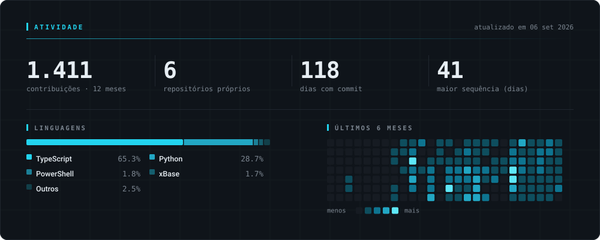

<!--
  Os SVGs de assets/ são gerados por scripts/render_cards.py a partir da API do
  GitHub e atualizados sozinhos pelo workflow .github/workflows/cards.yml.
  Não edite os .svg na mão — mexa no script.
-->

<picture>
  <source media="(prefers-color-scheme: dark)" srcset="./assets/hero-dark.svg">
  <source media="(prefers-color-scheme: light)" srcset="./assets/hero-light.svg">
  
</picture>

  

  

---

Trabalho no ponto onde o processo encosta no banco de dados: descubro a regra de
verdade com quem opera, escrevo o SQL e devolvo o número na tela — num relatório
ADVPL dentro do Protheus, num painel de BI ou num sistema web que eu mesmo subo e
mantenho no ar.

## Código aberto

| Repositório | O que resolve |
| :--- | :--- |
| **[claude-code-deck-skill](https://github.com/Jhonzw/claude-code-deck-skill)** | Transforma um documento em apresentação executiva de PowerPoint — formas e texto nativos, 100% editável. Python + python-pptx, licença MIT. |
| **[Forzap](https://github.com/Jhonzw/Forzap)** | SaaS multi-tenant de automação de atendimento no WhatsApp. Monorepo NestJS + Next.js, worker isolado via Redis pub/sub, RBAC e Socket.IO. |
| **[PC-Monitor](https://github.com/Jhonzw/PC-Monitor)** | Widget flutuante de hardware pra Windows: temperatura e potência lidas do MSR/RAPL e da NVML, em ~85 MB de RAM. |
| **[Executor-de-Fonte-Protheus](https://github.com/Jhonzw/Executor-de-Fonte-Protheus)** | Utilitário ADVPL que roda qualquer fonte novo na base DEV sem cadastrar menu no SIGACFG. Dispatch dinâmico com execução protegida. |

## Stack

|  |  |
| :--- | :--- |
| **Todo dia** | TypeScript · Node.js · PostgreSQL · SQL Server · ADVPL · SQL · Metabase · Git |
| **Com frequência** | React / Next.js · Prisma · Docker · nginx · Python · Linux |
| **Sei me virar** | NestJS · Redis · Power BI (DAX) · Java · Bash |

## Atividade

<picture>
  <source media="(prefers-color-scheme: dark)" srcset="./assets/stats-dark.svg">
  <source media="(prefers-color-scheme: light)" srcset="./assets/stats-light.svg">
  
</picture>

Cards gerados por [`scripts/render_cards.py`](./scripts/render_cards.py) direto da API do GitHub e commitados neste repo — sem serviço de terceiro pra sair do ar. A maior parte dos commits está em repositórios privados.
